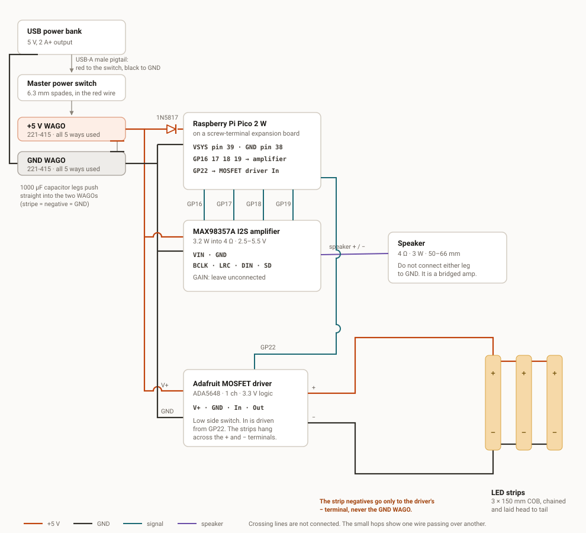

# Raijin Assembly

## Bill of Materials

| Item                                            | Description                                                                                                                                                                                                                                                                                                                                                                                                                                                                                             | Quantity | Link                                                                                                         |
|-------------------------------------------------|---------------------------------------------------------------------------------------------------------------------------------------------------------------------------------------------------------------------------------------------------------------------------------------------------------------------------------------------------------------------------------------------------------------------------------------------------------------------------------------------------------|----------|--------------------------------------------------------------------------------------------------------------|
| Raspberry Pi Pico 2 W, headers fitted           | Easiest to purchase the version with the headers fitted as we will be mounting this onto a breakout board.                                                                                                                                                                                                                                                                                                                                                                                              | 1        | [The Pi Hut](https://thepihut.com/products/raspberry-pi-pico-2-w?variant=54063378760065)                     |
| Freenove FNK0081 Breakout Board for Pico        |                                                                                                                                                                                                                                                                                                                                                                                                                                                                                                         | 1        | [Freenove Store](https://store.freenove.com/products/fnk0081)                                                |
| Adafruit ADA3006 MAX98357A amplifier            |                                                                                                                                                                                                                                                                                                                                                                                                                                                                                                         | 1        | [The Pi Hut](https://thepihut.com/products/adafruit-i2s-3w-class-d-amplifier-breakout-max98357a)             |
| Speaker, 4 Ω 3 W, flying leads                  | The speaker will connect to the amplifier via a WAGO connector so be sure to get a speaker with cables that have bare ends                                                                                                                                                                                                                                                                                                                                                                              | 1        | [The Pi Hut](https://thepihut.com/products/mono-enclosed-speaker-with-plain-wires-3w-4-ohm)                  |
| DFRobot DFR0457 Gravity MOSFET Power Controller | The Pico has the control logic but it is the MOSFET controller which does the switching                                                                                                                                                                                                                                                                                                                                                                                                                 | 1        | [The Pi Hut](https://thepihut.com/products/gravity-mosfet-power-controller)                                  |
| PAUTIX 5 V COB strip, 2 m                       | We will cut this into 3 strips and connect them such that they sit side by side on the enclosure lid                                                                                                                                                                                                                                                                                                                                                                                                    | 1        | [Amazon](https://www.amazon.co.uk/dp/B08XBW48K9?th=1)                                                        |
| USB-A male to bare-wire pigtail                 | You should get a charging cable with the power bank which you can cut to expose the bare-wire pigtail. More information on this is in the sections below.                                                                                                                                                                                                                                                                                                                                               | 1        |                                                                                                              |
| WAGO 221-415 (5-way)                            | A 5-way WAGO connector securely joins up to 5 wires together. This lets you feed power from one main wire into up to four outgoing wires. We use two 5-way connectors. One to distribute power and the other to act as a common ground                                                                                                                                                                                                                                                                  | 2        | [CPC](https://cpc.farnell.com/wago/221-415/compact-lever-connector-5-way/dp/CN20137)                         |
| WAGO 221-412 (2-way)                            | A 2-way WAGO connector securely joins 2 wires together. In this system it is used to join the speaker leads to the cables from the amplifier and the led strip to the cables from the MOSFET                                                                                                                                                                                                                                                                                                            | 4        | [CPC](https://cpc.farnell.com/wago/221-412/compact-lever-connector-2-way/dp/CN20135)                         |
| Belkin BoostCharge 10K (BPB011)                 | A 10000mAh power bank should give 90hrs of continuous use before needing recharged                                                                                                                                                                                                                                                                                                                                                                                                                      | 1        | [Belkin](https://www.belkin.com/uk/p/power-bank-10k/BPB011btBK.html)                                         |
| Panasonic EEUFR1A102L, 1000 µF 10 V             | When the strips switch on and a beep starts at the same moment, the box asks for about 1.4 A in an instant. The power bank and the cable to it cannot respond that fast, so the 5 V rail dips. A big enough dip resets the Pico. The capacitor sits next to the load with that energy already stored, and supplies the first few milliseconds itself while the bank catches up. 1000 µF is sized for that surge. The 10 V part is headroom. On a 5 V rail you want a capacitor rated at roughly double. | 1        | [CPC](https://cpc.farnell.com/panasonic/eeufr1a102l/capacitor-radial-10v-1000uf/dp/CA07459)                  |
| 1N5817 Schottky                                 | It lets you plug the micro-USB in without the two power sources fighting. You can leave the box switched on and plug in a laptop to reflash firmware.                                                                                                                                                                                                                                                                                                                                                   | 1        | [CPC](https://cpc.farnell.com/taiwan-semiconductor/1n5817/schottky-rectifier-1a-20v-do-204al/dp/SC21533)     |
| Power on/off toggle switch                      |                                                                                                                                                                                                                                                                                                                                                                                                                                                                                                         | 1        | [The Pi Hut](https://thepihut.com/products/illuminated-toggle-switch-with-cover-red)                         |
| 6.3 mm insulated spade crimps                   |                                                                                                                                                                                                                                                                                                                                                                                                                                                                                                         | 3        | [The Pi Hut](https://thepihut.com/products/spade-quick-connector-kit-6-3mm-4-8mm-2-8mm)                      |
| Hookup wire                                     | 7/0.2 mm (0.22 mm², approx 24 AWG) wire is suitable to carrying both power and signal. best to get a variety of colours so you can easily determine which wire is doing what                                                                                                                                                                                                                                                                                                                            |          | [CPC](https://cpc.farnell.com/concordia-technologies/ew7-0-2blk10m/equipment-wire-7-0-20mm-black/dp/CB19933) |
| Bootlace ferrules and crimper                   | Not strictly necessary but it can make it easier to secure the wire to the screw terminals                                                                                                                                                                                                                                                                                                                                                                                                              |          |                                                                                                              |
| Hammond 1556GAWH ABS box                        | This is the enclosue into which we will mount all the components and keep them out of sight. The outside of the lid will have the led strips.                                                                                                                                                                                                                                                                                                                                                           | 1        | [RS Components](https://uk.rs-online.com/web/p/general-purpose-enclosures/2777586)                           |
| Micro-USB cable                                 | Make sure you get a cable that carries both charge and data. Some only carry charge and you will not be able to flash the firmware.                                                                                                                                                                                                                                                                                                                                                                     | 1        | [The Pi Hut](https://thepihut.com/products/usb-c-to-micro-usb-cable-black)                                   |

## Wiring

Twenty-six connections in all: fourteen for power, six for signal and six for the outputs. Work down the lists and the box is wired.

### Wiring the power bank to the switch

#### USB-A male to bare-wire pigtail 
A USB-A male to bare-wire pigtail is  USB-A male plug with bare wires on the other end. Sold as a "USB power pigtail" 
or "USB-A to open end". These can easily be made by cutting the small end off any cheap USB cable.

A full USB cable has four conductors. Nominally red for +5 V, black for ground, and white and green for data. 
You want only the first two. Cut the data pair back and heatshrink them individually to avoid having bare data wires 
which could short against a terminal.

#### Making the connections
1. Drill a hole in the Hammond 1556GAWH ABS box and mount the switch
2. Crimp three 6.3 mm female insulated spades — pigtail red, a wire to the +5 V WAGO, and a wire to a spare GND terminal on the Pico board. Strip 5–6 mm, crimp, and tug each one firmly. A good spade takes deliberate force to pull off.
3. Push them on: pigtail red to the supply terminal, the +5 V WAGO wire to the switched output, the ground wire to the LED terminal.
4. Test before going further. Plug the pigtail into the bank, put the meter across the switched output and the pigtail's black wire: 0 V with the switch off, about 5 V with it on, and the switch's own lamp should light. Only now connect anything to the WAGO.
5. Anchor the pigtail with a cable tie base near the switch, so tugging the power bank never pulls on a spade terminal.

### Power connections

Fourteen connections. Work down the list and the power side of the box is wired.

| #   | From                                    | To                                      | Wire             | How                                                                                                                                                              |
|-----|-----------------------------------------|-----------------------------------------|------------------|------------------------------------------------------------------------------------------------------------------------------------------------------------------|
| P1  | Power bank USB socket                   | USB-A male pigtail                      | The cable itself | Plug it in. The far end is two bare wires, red and black.                                                                                                        |
| P2  | Pigtail red                             | Switch, + terminal                      | Pigtail's own    | 6.3 mm spade crimp. This is the supply coming in.                                                                                                                |
| P3  | Switch, headlamp terminal               | +5 V WAGO                               | 16/0.2           | Spade at the switch, bare wire into the WAGO. This one wire carries the whole box current, so everything after it is fed through it.                             |
| P4  | Switch, ground terminal                 | Pico board, spare GND terminal (pin 33) | 7/0.2            | Spade at the switch, bare wire into the screw terminal. This only feeds the switch lamp, 10 to 20 mA.                                                            |
| P5  | Pigtail black                           | GND WAGO                                | Pigtail's own    | Bare wire into the WAGO.                                                                                                                                         |
| P6  | Capacitor 1000 µF, + leg                | +5 V WAGO                               | Component leg    | The leg goes straight in. No wire, no crimp.                                                                                                                     |
| P7  | Capacitor 1000 µF, − leg (striped side) | GND WAGO                                | Component leg    | Same again. Fitting it the wrong way round destroys the capacitor.                                                                                               |
| P8  | +5 V WAGO                               | Schottky diode, plain leg               | Component leg    | The leg goes straight into the WAGO.                                                                                                                             |
| P9  | Schottky diode, striped leg             | Pico VSYS, physical pin 39              | Component leg    | Straight into the screw terminal. No crimp.                                                                                                                      |
| P10 | GND WAGO                                | Pico GND, physical pin 38               | 7/0.2            | Bare into the WAGO, bare into the GND screw terminal. The Pico draws about 130 mA.                                                                               |
| P11 | +5 V WAGO                               | MAX98357A VIN                           | 7/0.2            | Bare into the WAGO, Dupont onto the pin. Do not use 16/0.2 here, as a Dupont terminal will not close over 0.5 mm². At 0.7 A over 150 mm, 7/0.2 drops only 16 mV. |
| P12 | GND WAGO                                | MAX98357A GND                           | 7/0.2            | Same as P11. The return carries the same current as the feed.                                                                                                    |
| P13 | +5 V WAGO                               | MOSFET module VIN+                      | 16/0.2           | Bare into the WAGO, bare into the screw terminal. This feeds the strips at 0.45 A.                                                                               |
| P14 | GND WAGO                                | MOSFET module VIN−                      | 16/0.2           | Same as P13.                                                                                                                                                     |

#### What goes in each WAGO

There are only two WAGOs, one for each supply bus. The strips are chained to each other rather than fed one at a time, which is what keeps the count this low.

**+5 V bus, 5-way, all 5 ways used**

1. Switched supply from the switch (P3)
2. Capacitor + leg (P6)
3. Diode leg feeding the Pico (P8)
4. Amplifier VIN (P11)
5. MOSFET VIN+ (P13)

**Ground bus, 5-way, all 5 ways used**

1. Pigtail black (P5)
2. Capacitor − leg (P7)
3. Pico GND (P10)
4. Amplifier GND (P12)
5. MOSFET VIN− (P14)

Both buses are completely full, which is worth knowing before you add anything later. If you need a sixth wire on a bus, link a second WAGO to it with a short jumper. Never force two wires into one hole.

Low current grounds do not need to come here at all. The switch lamp goes to a spare GND screw terminal on the Pico board instead (P4), which is why ground still fits in one connector.

### Signal connections

Six connections. These carry no real current, so 7/0.2 is used throughout.

| #  | From                   | To                                   | Wire           | How                                                                                            |
|----|------------------------|--------------------------------------|----------------|------------------------------------------------------------------------------------------------|
| S1 | Pico GP16 (pin 21)     | MAX98357A BCLK                       | 7/0.2          | Screw terminal at the Pico, Dupont at the amplifier.                                           |
| S2 | Pico GP17 (pin 22)     | MAX98357A LRC                        | 7/0.2          | Same as S1.                                                                                    |
| S3 | Pico GP18 (pin 24)     | MAX98357A DIN                        | 7/0.2          | Same as S1.                                                                                    |
| S4 | Pico GP15 (pin 20)     | MOSFET module signal (green or blue) | Supplied cable | Use the module's own 3-pin Gravity cable. Cut the housing off the far end, see below.           |
| S5 | Pico 3V3(OUT) (pin 36) | MOSFET module VCC (red)              | Supplied cable | Same cable. Take this from the Pico's 3.3 V output, not from the 5 V bus.                      |
| S6 | Pico GND (pin 18)      | MOSFET module GND (black)            | Supplied cable | Same cable. This one is not optional. Without a shared ground the module switches erratically. |

#### The Gravity cable

S4, S5 and S6 are all one cable, not three separate wires. The MOSFET module comes with a 3-pin Gravity lead. Leave the PH2.0 plug on the module end, as it is a proper latching connector and worth keeping.

The other end will not plug into anything. It carries a 3-way Dupont housing, and the three pins you need are nowhere near each other. 3V3(OUT) is only available at pin 36, and its neighbours are 3V3_EN and a ground, so there is no run of three adjacent pins that gives you a signal, 3.3 V and a ground. The Pico end of this build is screw terminals in any case.

So cut the housing off, strip the three wires, fit a ferrule to each and screw them in by colour:

1. Green or blue is the signal, to GP15 (pin 20)
2. Red is VCC, to 3V3(OUT) (pin 36)
3. Black is ground, to GND (pin 18)

The crimps can be lifted out of the housing with a fine pick if you would rather not cut. It is not worth it. You end up putting a bare crimp into a screw terminal, which grips worse than a ferrule.

#### Pico pins used

Worth checking against your board before you start, so nothing clashes.

| Pin | Name     | Used by                            |
|-----|----------|------------------------------------|
| 18  | GND      | MOSFET module ground (S6)          |
| 20  | GP15     | MOSFET module signal (S4)          |
| 21  | GP16     | Amplifier BCLK (S1)                |
| 22  | GP17     | Amplifier LRC (S2)                 |
| 24  | GP18     | Amplifier DIN (S3)                 |
| 33  | GND      | Switch lamp (P4)                   |
| 36  | 3V3(OUT) | MOSFET module VCC (S5)             |
| 38  | GND      | Main ground from the GND bus (P10) |
| 39  | VSYS     | Main supply through the diode (P9) |

### Output connections

Six connections. This is everything that leaves the box: the speaker and the three LED strips.

| #  | From                | To                                            | Wire          | How                                                                                                                                      |
|----|---------------------|-----------------------------------------------|---------------|------------------------------------------------------------------------------------------------------------------------------------------|
| O1 | MAX98357A speaker + | 2-way WAGO at the lid split, then the speaker | Speaker's own | Strip 6 mm, into the 3.5 mm screw terminal, tighten. If you need to extend, use 16/0.2. This pair carries close to 0.9 A at full output. |
| O2 | MAX98357A speaker − | Same again, other pole                        | Speaker's own | Polarity does not matter with a single speaker. Swapping the pair only inverts the waveform.                                             |
| O3 | MOSFET OUT+         | Strip 1, + lead of its input clip             | 16/0.2        | Bare wire into the screw terminal. At the strip end, use the clip's own flying lead.                                                     |
| O4 | MOSFET OUT−         | Strip 1, − lead of its input clip             | 16/0.2        | Same as O3.                                                                                                                              |
| O5 | Strip 1, far end    | Strip 2, near end                             | Jumper's own  | A strip to strip clip jumper. Buy the version with a lead, not the gapless butt joint type. Your strips sit 25 mm apart, not end to end. |
| O6 | Strip 2, far end    | Strip 3, near end                             | Jumper's own  | Same as O5.                                                                                                                              |

#### Watch the polarity at every clip

The strip prints + and − along its length. Check the marking before you close each clip, at the input clip and at both jumpers. The speaker pair (O1 and O2) is the only place in the whole build where polarity does not matter.

#### The lid split

The 2-way WAGO on the speaker pair lets you lift the lid off without unsoldering anything. Put it close to the split so both halves have enough slack to sit apart on the bench.
